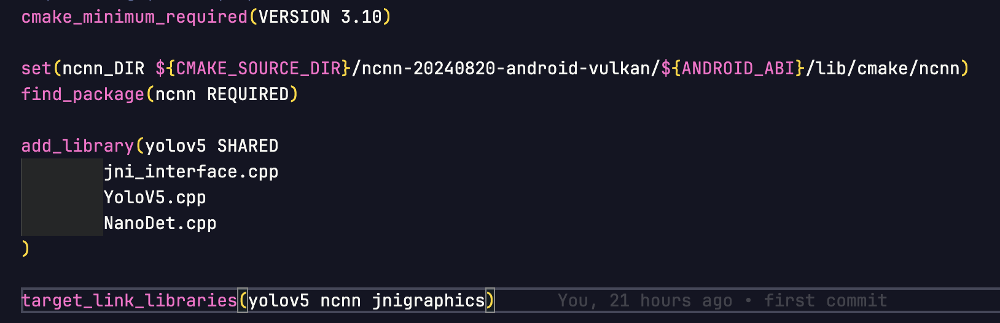

# NanoDet Plus Android Demo

This repository demonstrates an Android object detection application using the NanoDet Plus model and Tencent's NCNN framework. It is based on the [ncnn-android-nanodet](https://github.com/nihui/ncnn-android-nanodet) project.

## Features

- Real-time object detection on Android devices
- Utilizes the efficient NanoDet Plus model
- Powered by the high-performance NCNN neural network inference framework
- Easy-to-follow setup process

## Prerequisites

- Android Studio
- Android SDK
- Android NDK
- CMake

## Installation and Setup

### Step 1: Download NCNN Library

1. Download `ncnn-android-vulkan.zip` from the [NCNN GitHub releases page](https://github.com/Tencent/ncnn/releases).
   - Alternatively, you can build NCNN for Android from source if you need custom features.

### Step 2: Integrate NCNN into the Project

1. Unzip `ncnn-android-vulkan.zip` into the `demo_od/app/src/main/jni` directory.
2. Update the `ncnn_DIR` path in `demo_od/app/src/main/jni/CMakeLists.txt` to match your setup.

   

### Step 3: Add NanoDet Plus Model

1. Download the NanoDet Plus NCNN model files from [this Google Drive link](https://drive.google.com/file/d/1cuVBJiFKwyq1-l3AwHoP2boTesUQP-6K/view?usp=sharing).
2. Extract and rename the files to `nanodet.param` and `nanodet.bin`.
3. Copy these files into the `demo_od/app/src/main/assets` directory.

### Step 4: Build and Run the Application

1. Open the project in Android Studio.
2. Build the project using the "Build" menu or the hammer icon.
3. Run the application on an Android device or emulator.

## Usage

Once the app is installed on your Android device:

1. Launch the app.
2. Point your camera at objects you want to detect.
3. The app will display bounding boxes and labels for detected objects in real-time.

## mportant Notices

1. **FPS Measurement:** The FPS displayed in the app includes pre-processing, post-processing, and visualization times. It is not equivalent to the model inference time alone.
2. **NDK Version Mismatch:** If you encounter an error like "No version of NDK matched the requested version", set the ndkVersion in your build.gradle file to match your installed NDK version:

```gradle
    android {
        ndkVersion "your_ndk_version"
    }
```

1. **Custom Model Usage:** If you want to use a custom model, remember to adjust the hyperparameters in ```demo_od/app/src/main/cpp/NanoDet.h``` to match your training configuration.

## Performance

The performance of the object detection will vary based on the device's capabilities. For optimal results, we recommend using devices with powerful GPUs that support Vulkan.

## Troubleshooting

If you encounter any issues during setup or execution:

- Ensure all dependencies are correctly installed and up-to-date.
- Verify that the NCNN library and NanoDet model files are in the correct locations.
- Check the Android Studio logs for any error messages.

## Contributing

Contributions to improve the demo are welcome. Please follow these steps:

1. Fork the repository.
2. Create a new branch for your feature.
3. Commit your changes.
4. Push to the branch.
5. Create a new Pull Request.

## License

This project is licensed under the [MIT License](LICENSE).

## Acknowledgments

- [Tencent's NCNN Framework](https://github.com/tencent/ncnn)
- [NanoDet](https://github.com/RangiLyu/nanodet)
- [ncnn-android-nanodet](https://github.com/nihui/ncnn-android-nanodet)

## Contact

For any queries or support, please open an issue in this repository.
